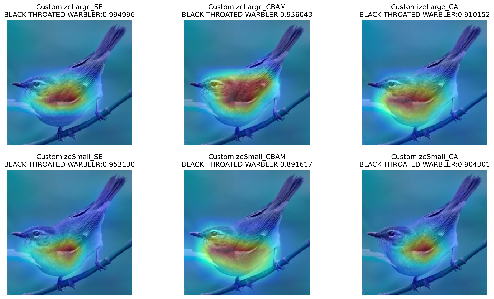

# Light-Weight-Convolutional-Neural-Network-for-Classification
本輕量化網路主要基於Cross Stage Partial Network(CSPNet)與MobileNet-V3建構而成，並使用Tensorflow2.x編寫。

This lightweight network is mainly based on Cross Stage Partial Network (CSPNet) and MobileNet-V3, and is written using Tensorflow2.x.

# Prerequisite
- Python 3.8.5
- tensorflow 2.8
- tensorflow-addons 0.16.1

# Dataset
 | Dataset | Link |
 | :---: | :-----: |
 | Cifar10  | https://www.cs.toronto.edu/~kriz/cifar.html |
 | Cifar100 | https://www.cs.toronto.edu/~kriz/cifar.html |
 |Brid 325   (目前已增加到400類) | https://www.kaggle.com/datasets/gpiosenka/100-bird-species |
 | Brid 100   ("Brid 325"前100種類) | https://www.kaggle.com/datasets/gpiosenka/100-bird-species |
  
# Grad-Cam

